# stin19-db-projektarbeit-Michel

## 6

### Bereinigung der Tabellen

#### Schritt 1

Einfügen einer neuen Spalte id in der Tabelle fahrzeiten_soll_ist als Primary Key

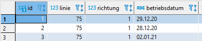

#### Schritt 2

Einfügen der Foreign Key Constraints fahrzeiten_soll_ist nach haltepunkt

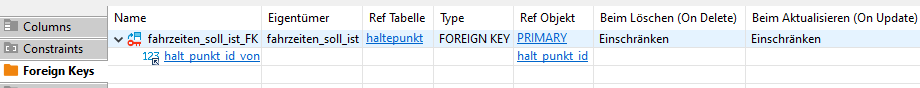

#### Schritt 3

Einfügen der Foreign Key Constraints haltepunkt nach haltestelle

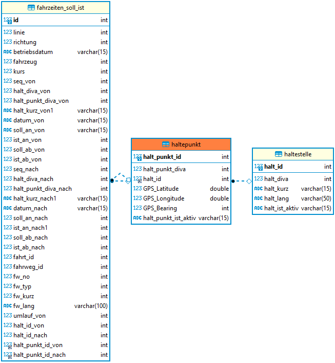

#### Schritt 4

Zusätzliche Spalten für DatumZeit

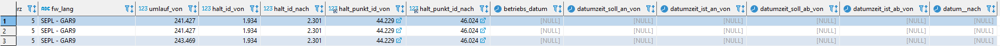

#### Schritt 5

Konvertierung der Datentypen 

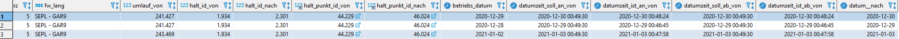

### Script von Schritt 1 bis 5

    USE vbzdata;
    -- Schritt1
    ALTER TABLE fahrzeiten_soll_ist ADD id INT PRIMARY KEY AUTO_INCREMENT FIRST;
    -- Schritt2
    ALTER TABLE fahrzeiten_soll_ist ADD CONSTRAINT fahrzeiten_soll_ist_FK FOREIGN KEY (halt_punkt_id_von) REFERENCES haltepunkt(halt_punkt_id);
    ALTER TABLE fahrzeiten_soll_ist ADD CONSTRAINT fahrzeiten_soll_ist_FK_1 FOREIGN KEY (halt_punkt_id_nach) REFERENCES haltepunkt(halt_punkt_id);
    -- Schritt 3
    ALTER TABLE haltepunkt ADD CONSTRAINT haltepunkt_FK FOREIGN KEY (halt_id) REFERENCES haltestelle(halt_id);
    -- Schritt 4
    ALTER TABLE fahrzeiten_soll_ist ADD betriebs_datum DATE NULL;
    ALTER TABLE fahrzeiten_soll_ist ADD datumzeit_soll_an_von DATETIME NULL;
    ALTER TABLE fahrzeiten_soll_ist ADD datumzeit_ist_an_von DATETIME NULL;
    ALTER TABLE fahrzeiten_soll_ist ADD datumzeit_soll_ab_von DATETIME NULL;
    ALTER TABLE fahrzeiten_soll_ist ADD datumzeit_ist_ab_von DATETIME NULL;
    ALTER TABLE fahrzeiten_soll_ist ADD datum__nach DATE NULL;UPDATE fahrzeiten_soll_ist SET betriebs_datum = STR_TO_DATE(betriebsdatum ,'%d.%m.%Y');
    -- Schritt 5
    UPDATE fahrzeiten_soll_ist SET datumzeit_soll_an_von = DATE_ADD(STR_TO_DATE(datum_von,'%d.%m.%Y'), INTERVAL soll_an_von SECOND);
    UPDATE fahrzeiten_soll_ist SET datumzeit_ist_an_von = DATE_ADD(STR_TO_DATE(datum_von,'%d.%m.%Y'), INTERVAL ist_an_von SECOND);
    UPDATE fahrzeiten_soll_ist SET datumzeit_soll_ab_von = DATE_ADD(STR_TO_DATE(datum_von,'%d.%m.%Y'), INTERVAL soll_ab_von SECOND);
    UPDATE fahrzeiten_soll_ist SET datumzeit_ist_ab_von = DATE_ADD(STR_TO_DATE(datum_von,'%d.%m.%Y'), INTERVAL ist_ab_von SECOND);
    UPDATE fahrzeiten_soll_ist SET datum__nach =STR_TO_DATE(datum_nach ,'%d.%m.%Y');ALTER TABLE fahrzeiten_soll_ist ADD datumzeit_soll_an_nach DATETIME NULL;
    ALTER TABLE fahrzeiten_soll_ist ADD datumzeit_ist_an_nach DATETIME NULL;
    ALTER TABLE fahrzeiten_soll_ist ADD datumzeit_soll_ab_nach DATETIME NULL;
    ALTER TABLE fahrzeiten_soll_ist ADD datumzeit_ist_ab_nach DATETIME NULL;
    UPDATE fahrzeiten_soll_ist SET datumzeit_soll_an_nach = DATE_ADD(STR_TO_DATE(datum_von,'%d.%m.%Y'), INTERVAL soll_an_nach SECOND);
    UPDATE fahrzeiten_soll_ist SET datumzeit_ist_an_nach = DATE_ADD(STR_TO_DATE(datum_von,'%d.%m.%Y'), INTERVAL ist_an_nach SECOND);
    UPDATE fahrzeiten_soll_ist SET datumzeit_soll_ab_nach = DATE_ADD(STR_TO_DATE(datum_von,'%d.%m.%Y'), INTERVAL soll_ab_nach SECOND);
    UPDATE fahrzeiten_soll_ist SET datumzeit_ist_ab_nach = DATE_ADD(STR_TO_DATE(datum_von,'%d.%m.%Y'), INTERVAL ist_ab_nach SECOND);

## 7

### Erstellen Sie eine Abfrage über Zeitdifferenzen

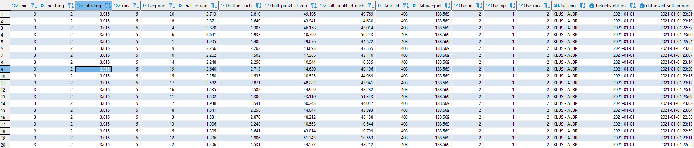

## 8

### Linien Tabelle

#### a & b

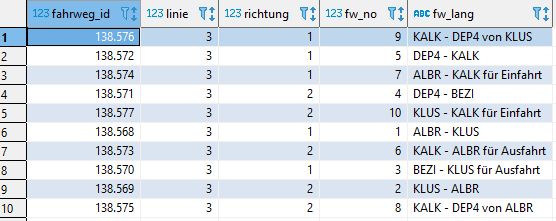

#### c

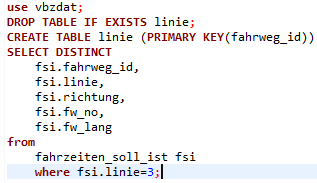

## 9

### Ankunftszeitentabelle

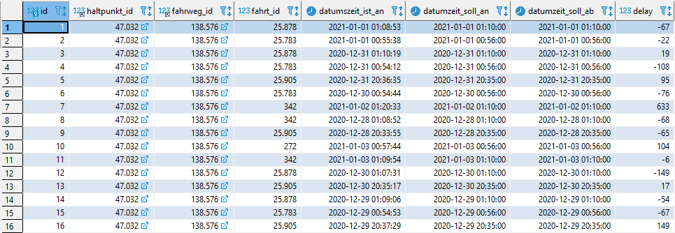

## 10

### Verspätungsliste pro Linie

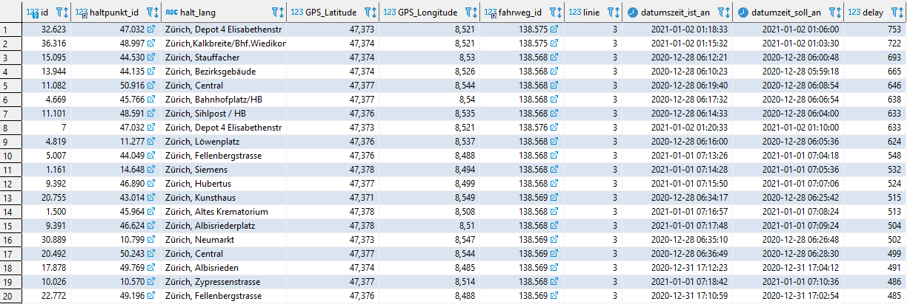

Script:

    use vbzdat;
    SELECT
      a.id,
      a.haltpunkt_id,
      h2.halt_lang,
      h.GPS_Latitude,
      h.GPS_Longitude,
      a.fahrweg_id,
      l.linie,
      a.datumszeit_ist_an,
      a.datumzeit_soll_an,
      a.delay
    FROM ankunftszeiten a
    INNER JOIN haltepunkt h ON
      a.haltpunkt_id = h.halt_punkt_id
    INNER JOIN haltestelle h2 ON
      h.halt_id = h2.halt_id
    INNER JOIN linie l ON
      a.fahrweg_id = l.fahrweg_id
    ORDER BY a.delay DESC
    LIMIT 20;

Export Tabelle für Map

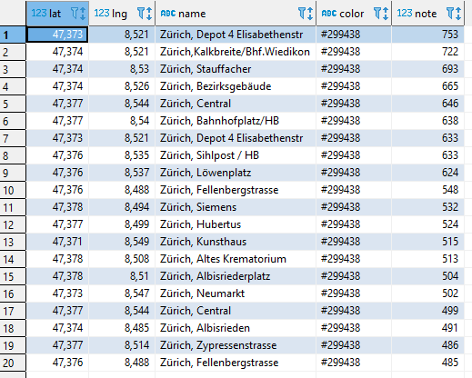

Script:

    use vbzdat;
    CREATE TABLE delay_export_linie_3
    SELECT
      h.GPS_Latitude AS lat,
      h.GPS_Longitude AS lng,
      h2.halt_lang AS name,
      '#299438' AS color,
      a.delay AS note
    FROM ankunftszeiten a
    INNER JOIN haltepunkt h ON
      a.haltpunkt_id = h.halt_punkt_id
    INNER JOIN haltestelle h2 ON
      h.halt_id = h2.halt_id
    INNER JOIN linie l ON
      a.fahrweg_id = l.fahrweg_id
    ORDER BY a.delay DESC
    LIMIT 20;
    
Map mit Delay Standorten
    
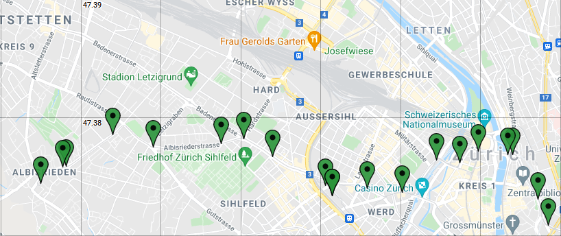

## 11

Die Linie 3 auf der Map

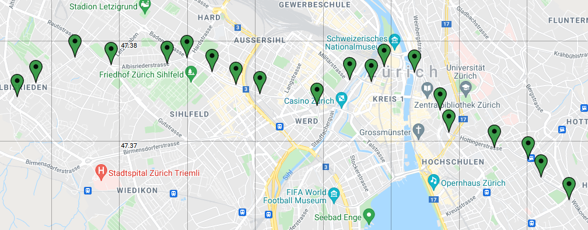

## 12

Fahrzeiten Linie 3

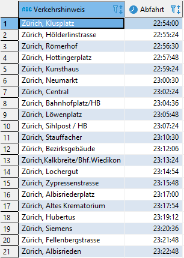

## 13

Vier nächste Stationen zum Paradeplatz: 47.36975, 8.53890

Tabelle

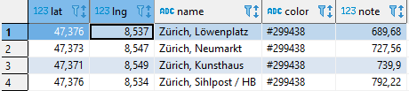

Map

## 14

